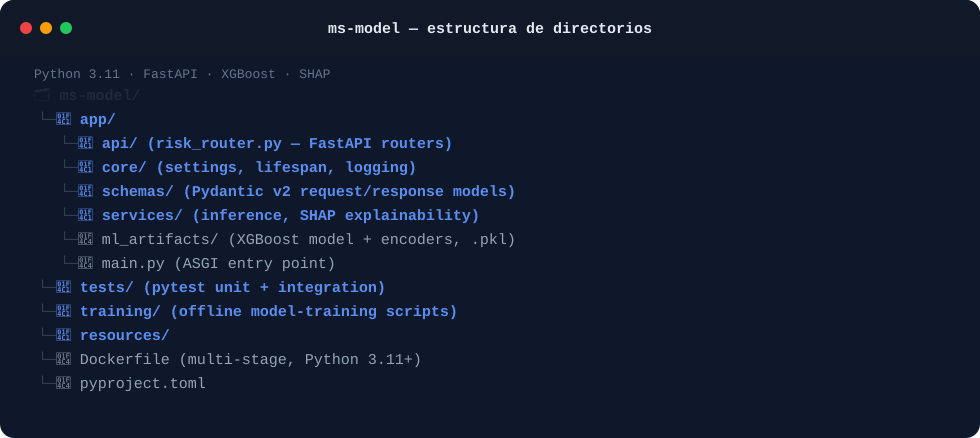

# ms-model

**Microservicio de scoring mediante aprendizaje automático de la plataforma RIntellix.**

`Python 3.11+` · `FastAPI` · `XGBoost` · `SHAP` · `Arquitectura en Capas`

---

## 1. Descripción general

`ms-model` es el núcleo de machine learning de RIntellix. Dado un conjunto de atributos
estructurados de una solicitud de préstamo o tarjeta de crédito, devuelve una predicción de
**probabilidad de impago (PD)** junto con un **desglose de explicabilidad** (los principales
factores de riesgo que influyen en la predicción, mediante SHAP), de forma que un analista de
riesgo pueda entender *por qué* el modelo ha generado una puntuación determinada, y no solo
conocer la puntuación en sí.

Es un servicio de predicción sin estado: no persiste datos ni llama a otros servicios de
RIntellix; es invocado de forma síncrona por `ms-risk-engine` para cada simulación.

## 2. Aspectos clave del sistema

- **Arquitectura en capas limpia.** `api/` (routers de FastAPI), `core/` (configuración, ciclo
  de vida de la aplicación, logging), `schemas/` (validación de peticiones/respuestas con
  Pydantic v2), `services/` (lógica de negocio e inferencia ML), `ml_artifacts/` (el modelo
  XGBoost entrenado y sus codificadores).
- **IA explicable por diseño.** Cada predicción va acompañada de un ranking basado en SHAP con
  los 5 factores más influyentes, calculado por `InferenceService`; esta es la fuente de datos
  de la sección de "factores de riesgo" mostrada en el frontend y en el informe PDF generado.
- **Soporte multi-producto.** El servicio soporta más de un producto crediticio (préstamos
  personales y tarjetas de crédito) mediante esquemas de petición separados y explícitamente
  tipados, en lugar de un único payload genérico, manteniendo una validación estricta por
  producto.
- **Configuración de FastAPI orientada a producción y asíncrona.** Manejadores de endpoint
  asíncronos, un *health check* documentado (`/health`, usado por el `HEALTHCHECK` de Docker) y
  gestión global de errores.
- **Fijación de dependencias reproducible.** Todas las dependencias de ejecución están fijadas a
  versiones exactas en `pyproject.toml` para mantener la inferencia del modelo numéricamente
  reproducible entre entornos.

### Endpoints REST principales

Todos los endpoints se sirven bajo el prefijo configurado de la API v1 (`{API_V1_PREFIX}/risk`):

| Método | Ruta | Propósito |
|---|---|---|
| `GET` | `/risk/model-info` | Metadatos del modelo ML cargado y de la configuración del servicio |
| `POST` | `/risk/predict-loan` | Predicción de PD + explicación SHAP para una solicitud de préstamo |
| `POST` | `/risk/predict-credit-card` | Predicción de PD + explicación SHAP para una solicitud de tarjeta de crédito |

La documentación interactiva OpenAPI/Swagger está disponible en `/docs` una vez el servicio está
en ejecución.

### Estructura del repositorio

El siguiente esquema ilustra la distribución del código fuente y cómo las piezas clave de la arquitectura descrita encajan en las carpetas principales del proyecto:



## 3. Tecnologías

- **Lenguaje / runtime:** Python 3.11 o superior
- **Framework:** FastAPI + Uvicorn (ASGI)
- **Validación:** Pydantic v2 / `pydantic-settings`
- **ML:** XGBoost (modelo), SHAP (explicabilidad), scikit-learn, NumPy, pandas
- **Testing / herramientas:** pytest, pytest-asyncio, httpx, ruff, mypy

## 4. Requisitos previos

- Python 3.11 o superior
- `pip` (o `conda`)

## 5. Puesta en marcha

> `**IMPORTANTE**`

> **Despliegue global de la plataforma**:
> Este repositorio contiene únicamente el código del motor de ML. Para levantar la plataforma RIntellix completa (incluyendo este motor, bases de datos y el resto de microservicios), clona el repositorio principal de infraestructura **[TFG-RIntellix/rintellix-deployment]** y sigue sus instrucciones.

Los siguientes comandos se proporcionan para el desarrollo local, revisión de código y ejecución de pruebas:

```bash
# 1. Clonar el repositorio (esta rama)
git clone --branch TSK001-BaseImpl https://github.com/TFG-RIntellix/ms-model.git
cd ms-model

# 2. Crear y activar un entorno virtual
python -m venv venv
source venv/bin/activate        # Windows: venv\Scripts\activate

# 3. Instalar el proyecto (dependencias de ejecución) — añade "[dev]" para tests/notebooks
pip install -e ".[dev]"
```

Los artefactos del modelo entrenado ya se incluyen en `app/ml_artifacts/`, por lo que no es necesario realizar un paso de entrenamiento aparte.

## 6. Configuración

La configuración de ejecución se gestiona mediante `pydantic-settings` en `app/core/`. Cualquier parámetro puede sobrescribirse mediante variables de entorno (p. ej., fichero `.env` o variables de entorno del contenedor).

| Variable | Descripción | Valor por defecto |
|---|---|---|
| `API_V1_PREFIX` | Prefijo para los endpoints de la API | `/api/v1` |
| `MODEL_PATH` | Ruta al modelo XGBoost entrenado | `app/ml_artifacts/model.xgb` |
| `LOG_LEVEL` | Nivel de detalle de los logs (INFO, DEBUG, etc.) | `INFO` |

## 7. Pruebas

```bash
pytest
```

Los tests unitarios e de integración se encuentran en `tests/`. Los scripts de reentrenamiento
del modelo fuera de línea (que no forman parte del servicio en ejecución) se encuentran en
`training/`.

## 8. Servicios relacionados

- **ms-risk-engine** — único consumidor de este servicio; invoca `/risk/predict-loan` y
  `/risk/predict-credit-card` de forma síncrona como parte del flujo de simulación.

## 9. Autora

Lucía Fernández Mancebo — TFG *RIntellix*, Universidad de Cantabria.


